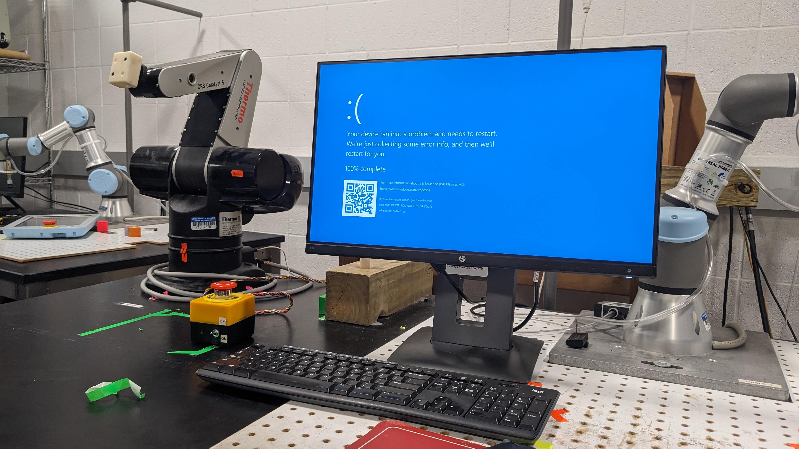

## Robot Dynamics & Controls (ME446)

This was my first time designing control systems for practical systems. Over the course of a semester I built up DC motor control, joint control, inverse dynamics, task space control, and impedance control. At the end of the semester I combined these to navigate an obstacle course.